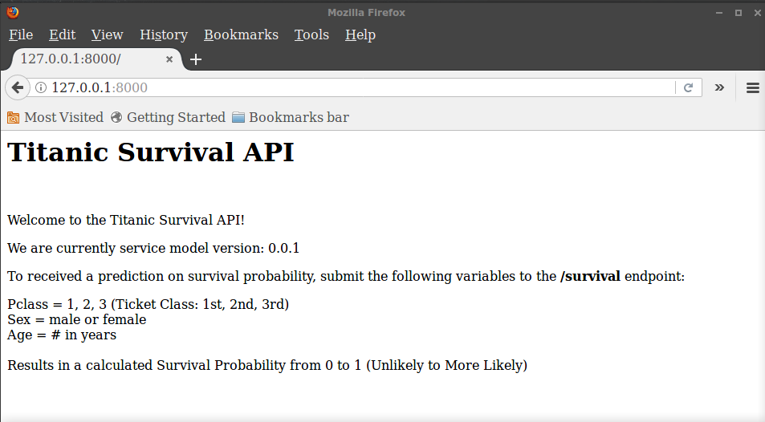
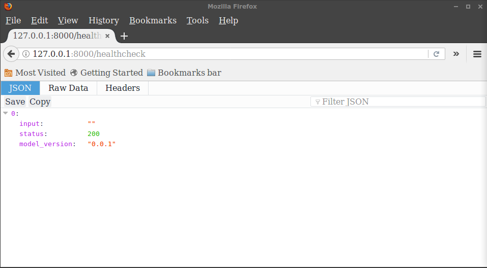
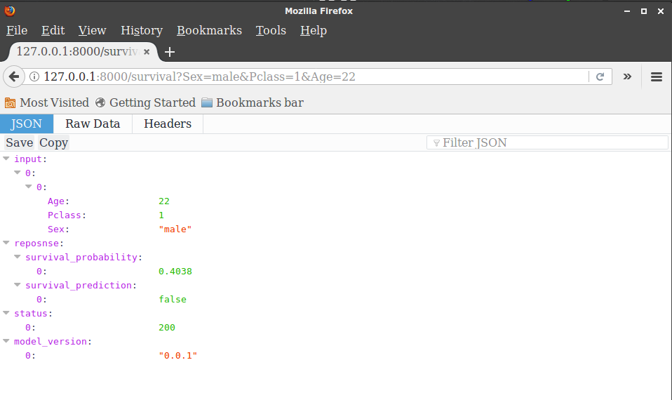
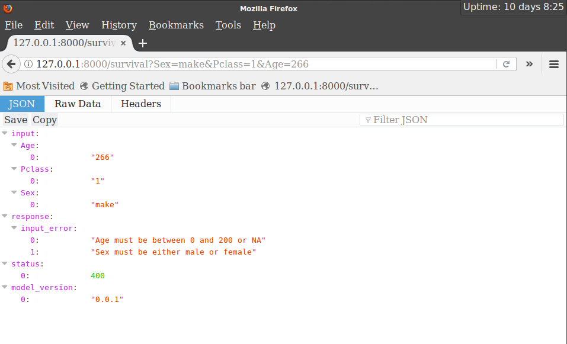
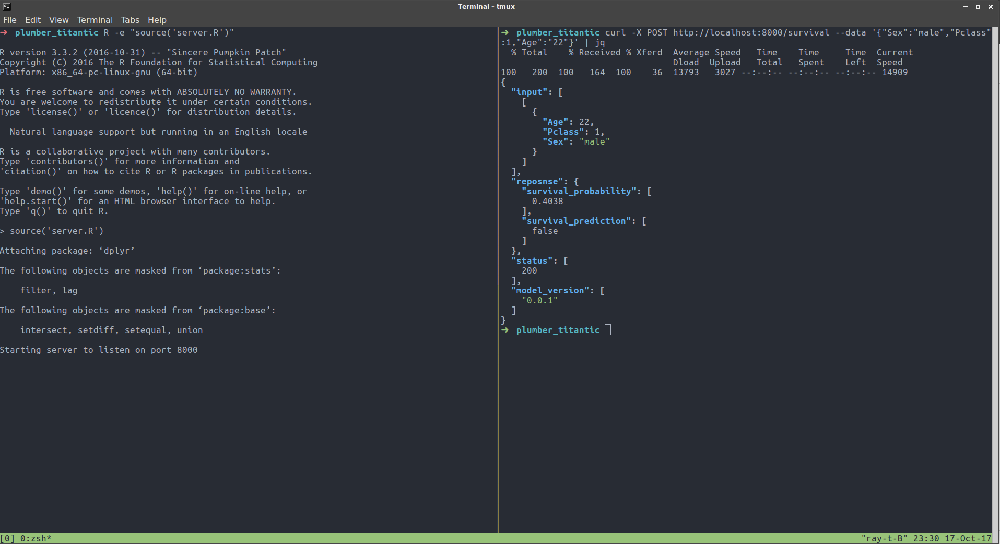

# plumber-titanic

Code for [blog post 2017/10/27](https://raybuhr.github.io/2017/10/making-predictions-over-http/)

Demonstrates how we can take a trained predictive model (i.e. statistical learning model or machine learning model) and deploy it to a server as a RESTful API that accepts JSON requests and returns JSON responses. To do this, we will use the package [plumber](https://www.rplumber.io/).

There are two main files:

- `titanic-api.R` which uses functions in R as the logic for our REST API
- `server.R` which sources the functions and uses the plumber annotations to generate web API endpoints, then starts a local webserver

The API here has three main components:

1. Landing Page - presents a simple HTML page explaining the API at `/`I

2. Health Check - a generic endpoint at `/healthcheck` used to test if server is responding

3. Survival Prediction - the main goal, a RESTful HTTP API 

  - responds to url query string or JSON body payload requests with a probability of survival

  - provides useful responses when requests features don't meet expectations

And over course, this works from the command line as well. Here is hitting with a simple curl request (piped into jq).

